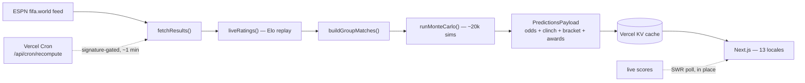

<div align="center">

<a href="https://worldcup2026predictions.app">
  
</a>

# 🏆 World Cup 2026 Predictor

**A live Monte Carlo forecast of the 2026 FIFA World Cup.** Elo + Poisson model, ~20,000 simulated tournaments, real results replayed as they happen — title odds, advancement and knockout-bracket probabilities, the Golden Boot race, and a scorecard that grades the model against reality.

<p>
  <a href="https://worldcup2026predictions.app"></a>
  <a href="https://github.com/claudfuen/worldcup-2026-predictions/stargazers"></a>
  
  
  
  
  
  
  
</p>

[**Live demo**](https://worldcup2026predictions.app) · [Bracket](https://worldcup2026predictions.app/bracket) · [Golden Boot](https://worldcup2026predictions.app/awards) · [Scorecard](https://worldcup2026predictions.app/scorecard) · [Methodology](https://worldcup2026predictions.app/methodology)

<sub>Built by <a href="https://claudfuen.com">Claudio Fuentes</a> — co-founder of <a href="https://trycomp.ai">Comp AI</a>, two-time technical founder building production AI systems.</sub>

</div>

---

## Overview

**World Cup 2026 Predictor** is a self-contained statistical model of the 48-team, 12-group FIFA World Cup. It rates every national team with World-Football Elo, models each fixture with a Poisson / Dixon-Coles scoreline distribution, and simulates the entire remaining tournament **~20,000 times** to produce readable football odds: champion probability, advancement chances, group standings, a projected knockout bracket, the best-third-place race, and the Golden Boot / assists races.

It pulls **live results from ESPN's public feed**, replays Elo ratings deterministically (no drift), and serves everything through a Next.js dashboard in **13 languages** — with no sign-in and nothing to configure. The whole forecast is free and updates in real time as matches are played.

**▶ Live → [worldcup2026predictions.app](https://worldcup2026predictions.app)**

> If you find this useful or interesting, a ⭐ helps others discover it.

## What makes it different

- **Probability *and* certainty, never confused.** Percentages come from the simulation; a **✓** comes from exhaustive [clinch enumeration](lib/sim/clinch.ts) over every remaining scoreline and appears only when a result is mathematically locked. The UI never shows a sim probability as a fact.
- **It grades itself.** A [`/scorecard`](https://worldcup2026predictions.app/scorecard) page scores the model's own pre-match calls against what actually happened — **Brier score, favourite hit-rate, and a calibration curve** — so you can see whether the forecast is any good, not just trust it.
- **Real-time, not refresh-to-update.** Live scores, clocks, win-probability and the bracket update *in place* via SWR polling — the win bar even re-routes off the live scoreline, minute, shots, possession and red cards.
- **The hard rules, done right.** The 2026 tiebreaker change (head-to-head *before* goal difference), a verified **495-row FIFA Annex C** third-place table, and an extra-time + penalty-shootout knockout model — all unit-tested.

## Features

**The model**
- **World-Football Elo** seeded from ~49,000 international matches, updated after every result — tournament-weighted K, margin-of-victory multiplier, host-nation advantage.
- **Poisson / Dixon-Coles** scorelines: each Elo gap → two goal rates → win/draw/loss + a full scoreline distribution (for goal-difference tiebreakers).
- **20,000-iteration Monte Carlo** over every remaining match, with per-iteration rating uncertainty to keep the tails honest. Deterministic given a seed.
- **2026 FIFA tiebreakers** exactly — head-to-head before overall goal difference, with recursive resolution of multi-team ties — plus the verified **495-row Annex C** best-third assignment.

**Live experience**
- **Real-time updates** (SWR) — ticker, scores, clocks, live win-probability and provisional standings tick on their own, no page reload.
- **Live win-probability** conditioned on the current scoreline, minute remaining, **shots, possession and red cards** — shown alongside the pre-match read.
- **Knockout "to advance"** framing (no fake draw) with the chance a tie goes to extra time / penalties.

**The product**
- **Awards** — live [Golden Boot](https://worldcup2026predictions.app/awards) + assists races with a forecast of the final tally and each player's chance to win (plus definitive *out* states).
- **Scorecard** — the model-accuracy retrospective: Brier, hit-rate, calibration, and the pre-tournament champion call.
- **Matchup ranking** — every match shows each side's Elo strength rank, tap to toggle the official FIFA ranking.
- **Bracket, calendar, schedule** views, per-match and per-team pages, and a champion-crown state once the final is played.
- **13 languages** with localized routing, team/country names, hreflang, RTL (Arabic); **installable PWA** with dynamic OG cards; local time everywhere.

## How the model works

Full methodology in-app at **[/methodology](https://worldcup2026predictions.app/methodology)**. Every remaining match runs through this pipeline ([`lib/predictions.ts`](lib/predictions.ts)):

1. **Ingest** completed results from ESPN's `fifa.world` scoreboard (no API key).
2. **Rate** — pre-tournament Elo with every completed match *replayed* via the World-Football Elo update (deterministic, no drift).
3. **Model** each fixture: Elo gap → two Poisson goal rates → Dixon-Coles W/D/L + sampled scorelines; knockouts add extra time and a penalty-shootout model.
4. **Simulate** ~20,000 tournaments: build the 12 group tables under the 2026 tiebreakers, select + assign the 8 best thirds via Annex C, and play the bracket to a champion.
5. **Report** probabilities (group winner / advance / reach-each-round / champion) + clinch states + per-match projections + the awards races.

The model backtests at a ranked probability score around **0.178** (bookmaker-competitive) — and now scores itself live on [`/scorecard`](https://worldcup2026predictions.app/scorecard). The engine under [`lib/sim/`](lib/sim/) is pure, framework-agnostic, and fully unit-tested.

## Architecture



One model run serves every locale and every visitor: the payload is cached **global/shared** in KV. A **signature-gated cron** recomputes only when a live score, clock or result actually moves (idle otherwise). Pages are `force-dynamic` server components that render the cached payload for SEO, then **client islands poll for live updates** (no full-page refresh). `PRED_KEY` in [`lib/kv.ts`](lib/kv.ts) is versioned so a payload-shape change invalidates stale cache.

## Internationalization

13 locales (English + Spanish, Portuguese, French, German, Italian, Russian, Arabic, Hindi, Indonesian, Japanese, Korean, Chinese), built to scale: **adding a language is one entry in [`lib/i18n/config.ts`](lib/i18n/config.ts) + one translated catalog** — routing, hreflang, sitemap and the switcher all iterate that config.

- **Routing** — English at the root (`/bracket`), every other locale prefixed (`/es/bracket`); a Next 16 [`proxy.ts`](proxy.ts) stamps the locale. Slugs stay English-stable.
- **Translation** — `getT()` in server components, `useT()` in client components, one catalog + a dependency-free ICU-subset formatter (interpolation + correct plurals), with per-key English fallback.
- **Native** — UI copy, methodology prose, team/country names, locale dates in the viewer's timezone, hreflang + `x-default`, RTL for Arabic.

## Project structure

```text
app/
  [lang]/   localized routes: overview, groups, bracket, schedule, calendar,
            awards, scorecard, methodology, match/[match], team/[slug], group/[letter]
  api/      cron recompute · predictions/data JSON · per-match live · auth (BetterAuth)
proxy.ts    Next 16 locale router

lib/
  sim/          pure engine — elo, poisson, standings (2026 tiebreakers),
                thirdPlace (Annex C), knockout, clinch, simulate, rng
  data/         verified static data — teams + Elo, schedule, bracket, 495-row table, FIFA ranks
  i18n/         config-driven i18n — config, server (getT), provider (useT), messages/*.json
  predictions.ts  pipeline   espn.ts  live ingest + replay   awards.ts  Golden Boot
  scorecard.ts    model accuracy   live.ts / useLivePoll.ts  realtime SWR   kv.ts  cache

components/   UI — bracket, calendar, match islands, awards board, scorecard, ticker, ...
```

## Tech stack

- **[Next.js 16](https://nextjs.org)** (App Router, React 19, server components, `next/og` dynamic images) + **[SWR](https://swr.vercel.app)** for real-time client polling
- **[Tailwind CSS v4](https://tailwindcss.com)** + shadcn-style components, dark stadium-night theme
- **TypeScript** + **[Bun](https://bun.sh)** · **[Vitest](https://vitest.dev)** for the engine
- **[Vercel](https://vercel.com)** hosting + Cron (recompute) + KV (Upstash Redis) cache
- **Neon Postgres** + **BetterAuth** (optional, dormant auth backend)

## Quick start

Requires [Bun](https://bun.sh).

```bash
bun install
cp .env.example .env.local   # all values optional in dev (see below)
bun run dev                  # http://localhost:3000
```

Runs with **no env vars** — it computes predictions on demand (~6 s first render). KV is recommended so renders read a cache instead of recomputing.

## Environment variables

| Variable | Required | Purpose |
|----------|----------|---------|
| `KV_REST_API_URL` / `KV_REST_API_TOKEN` | recommended | Vercel KV / Upstash Redis REST — cached prediction payload |
| `CRON_SECRET` | recommended | Bearer token protecting `/api/cron/recompute` |
| `NEXT_PUBLIC_STUBHUB_CAMREF` | optional | Affiliate camref for ticket links (public, not secret) |
| `DATABASE_URL` | optional | Postgres (Neon) for the dormant auth backend |
| `BETTER_AUTH_SECRET` / `BETTER_AUTH_URL` | optional | BetterAuth (magic-link) config |
| `RESEND_API_KEY` / `EMAIL_FROM` | optional | Auth emails (else magic links print to the console) |

## Commands

```bash
bun run dev          # Next.js dev server
bun run build        # production build
bun run typecheck    # tsc --noEmit (build does NOT type-check)
bun run lint         # eslint
bun run test         # vitest — tiebreakers, Annex C, bracket, match model, awards, scorecard, full sim
bun run format       # prettier --write
```

Dev / QA scripts (`bun run scripts/<name>.ts`): `bench` (Monte Carlo throughput), `smoke` (live fetch → compute → KV roundtrip), `i18n-validate` (locale catalog parity), and `qa.py` (invariants against the deployed `/api/data`).

## Live data & the recompute cron

`GET /api/cron/recompute` pulls completed results from ESPN's public `fifa.world` feed (no key), rebuilds ratings, runs the Monte Carlo, and writes the payload to KV. Vercel Cron calls it on a schedule (see [`vercel.json`](vercel.json)), authenticating with `CRON_SECRET`, and is **signature-gated** — it skips the heavy simulation when nothing has changed and recomputes the instant a score, clock or result moves. Live in-progress scores are also polled per client so the UI updates without a full reload, and the cron stops after the final so it never polls ESPN forever.

## Deployment

Deploys on Vercel out of the box: connect the repo, set the env vars above, add a Cron job hitting `/api/cron/recompute`, and set the production domain (for the locale sitemap + hreflang). Any platform supporting Next.js 16 + a scheduled HTTP request works.

## Author

Built by **[Claudio Fuentes](https://claudfuen.com)** — co-founder of **[Comp AI](https://trycomp.ai)** (AI-powered compliance automation), and a two-time technical founder (previously CEO of Leap AI; led enterprise AI product at Pypestream). This is a solo nights-and-weekends project — an end-to-end study in applied probabilistic modeling, real-time data pipelines, and production full-stack engineering: a from-scratch Elo + Poisson/Dixon-Coles model, a deterministic 20k-iteration Monte Carlo, exhaustive clinch enumeration, live self-calibration, and a 13-locale Next.js front end, all in one codebase.

[claudfuen.com](https://claudfuen.com) · [LinkedIn](https://www.linkedin.com/in/claudiofuen/) · [X](https://x.com/claud_fuen) · [GitHub @claudfuen](https://github.com/claudfuen)

## License

[MIT](LICENSE) — free to use, fork and build on. Live data via ESPN. Not affiliated with FIFA. Ratings and predictions are for entertainment.
